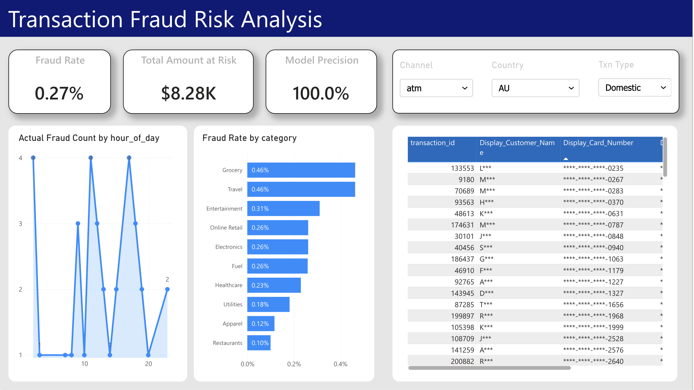
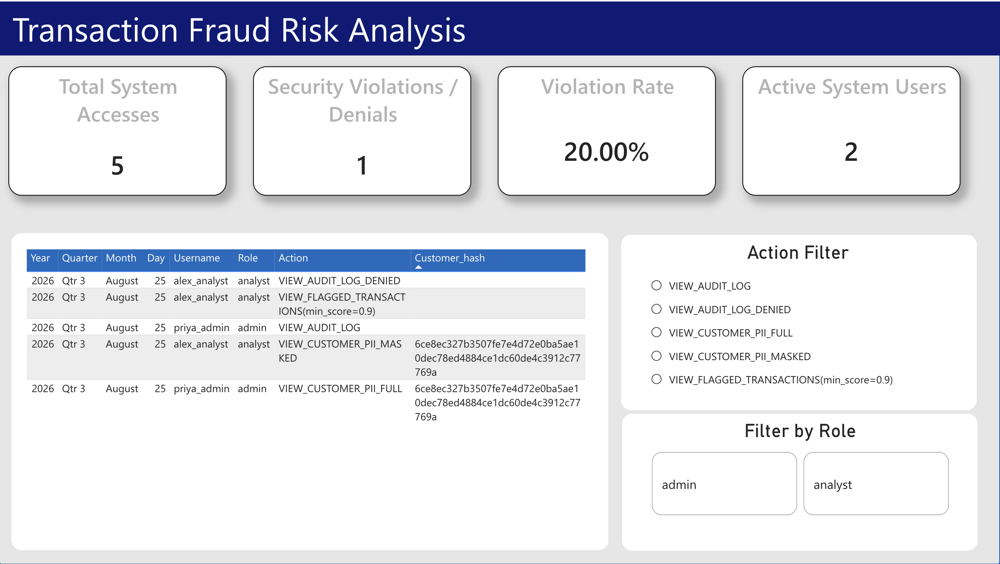
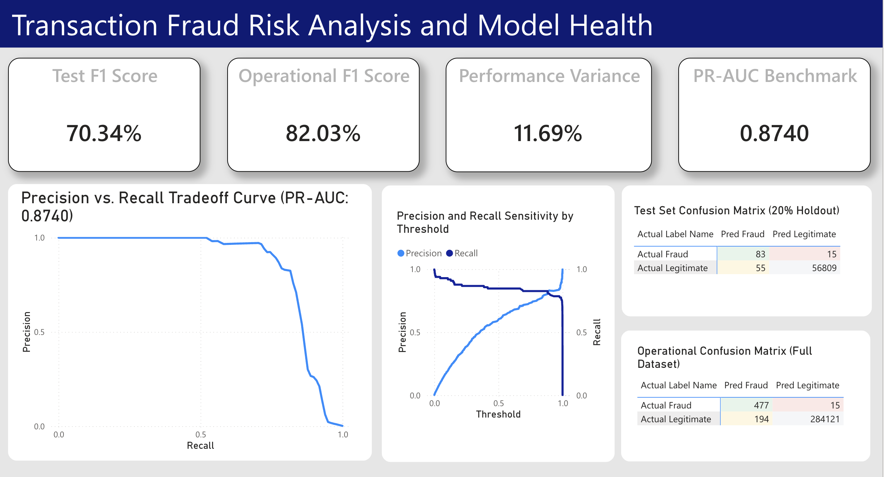

# Transaction Fraud Risk Analytics & Security Platform

An end-to-end transaction fraud detection platform built using XGBoost, featuring database-level PII segregation, role-based access control (RBAC), audit logging, and dynamic data masking in Power BI.


---

## 📌 Executive Summary

Modern financial analytics systems require a balance between operational risk monitoring and strict data privacy compliance (GDPR, PCI-DSS). This project implements an end-to-end fraud detection and security pipeline for credit card transactions. It couples an XGBoost classifier with database-level PII protection (PCI-DSS / GDPR principles), ensuring operational analysts monitor transaction risk without exposing raw Personally Identifiable Information.

### Key Performance Highlights
* **Dataset:** 284,807 transactions with an extreme class imbalance (492 frauds, 0.17% fraud rate).
* **ML Model:** XGBoost classifier reaching **90.8% Precision, 80.5% Recall, and 0.874 PR-AUC** (outperforming a ~6% precision Logistic Regression baseline).
* **Feature Engineering:** Contextual enrichment across customer behavior, merchant categories, and geolocation. The engineered feature `is_foreign_txn` ranked as the **#3 most critical feature** in model feature importance.
* **Security Layer:** SHA-256 PII hashing, Role-Based Access Control (`Analyst` vs. `Admin`), database views (`customers_masked`), dynamic DAX masking, and automated access audit logging.

---

## 🔒 Security, Privacy & RBAC Implementation

### 1. Physical PII Segregation
All sensitive customer data (`full_name`, `email`, `billing_address`, `card_number`) is stored in a physically isolated table. Operational transaction tables reference customer records strictly using a surrogate SHA-256 hash key (`customer_hash`).

### 2. Database Masking View (`customers_masked`)
Non-administrative queries consume a sanitized view:
* **Name Redaction:** `John Doe` → `J***`
* **Card Truncation:** `4532-XXXX-XXXX-1234` → `****-****-****-1234`

### 3. Application Enforcement Layer (`app/data_access.py`)
All downstream data reads are routed through a Python access control module:
* **`Analyst` Role:** Automatically routed to masked queries. Attempts to access raw PII or audit logs are blocked and logged.
* **`Admin` Role:** Granted full access to unmasked customer records and compliance audit trails.
* **Audit Trail:** Every access request generates an immutable event entry in `audit_log`.

### 4. Power BI Dynamic Column-Level Security (CLS)
To prevent model evaluation failures caused by rigid RLS table drops, security is handled via dynamic DAX measures:
```dax
Display_Customer_Name = 
IF(
    USERPRINCIPALNAME() = "priya_admin" || (HASONEVALUE(dim_report_users[role]) && SELECTEDVALUE(dim_report_users[role]) = "admin"),
    LOOKUPVALUE(RESTRICTED_dim_customers_full[full_name], RESTRICTED_dim_customers_full[customer_hash], SELECTEDVALUE(fact_transactions[customer_hash])),
    LOOKUPVALUE(dim_customers_masked[name_masked], dim_customers_masked[customer_hash], SELECTEDVALUE(fact_transactions[customer_hash]))
)
```

## 📊 Dashboards & Analytics Suite

The project features a 3-page Power BI reporting suite connected to processed star-schema tables, security audit logs, and model evaluation metrics.

### 1. Executive Fraud Risk Dashboard


* **Key Metrics:** Highlights total fraud volume, high-risk merchant categories, and model prediction outcomes.

---

### 2. Security & Compliance Audit Log


* **Access Governance:** Tracks access counts by role (`analyst` vs `admin`).
* **Security Flagging:** Surfaces unauthorized access attempts (`VIEW_AUDIT_LOG_DENIED`) via dynamic conditional red highlighting.

---

### 3. Model Health & Performance Validation


* **Generalization & PR-AUC:** Tracks model calibration across probability thresholds, anchoring a **0.8740 PR-AUC** tradeoff curve suited for imbalanced fraud distributions.
* **Holdout vs. Operational Evaluation:** Compares the 20% holdout test set (**70.34% F1-Score**, 83 TP, 15 FN, 55 FP) against full dataset operational scoring (**82.03% F1-Score**, 477 TP, 15 FN, 194 FP).
* **Sensitivity Tuning:** Interactive threshold slicing helps teams optimize the precision-recall trade-off based on business cost tolerances.

---

> **Inspection Template:** Download or clone [`powerbi/fraud_risk_analytics.pbit`](./powerbi/fraud_risk_analytics.pbit) to view the underlying schema, relationships, and DAX measures in Power BI Desktop.